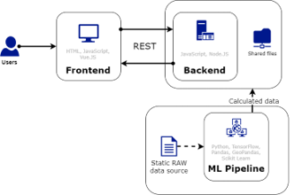
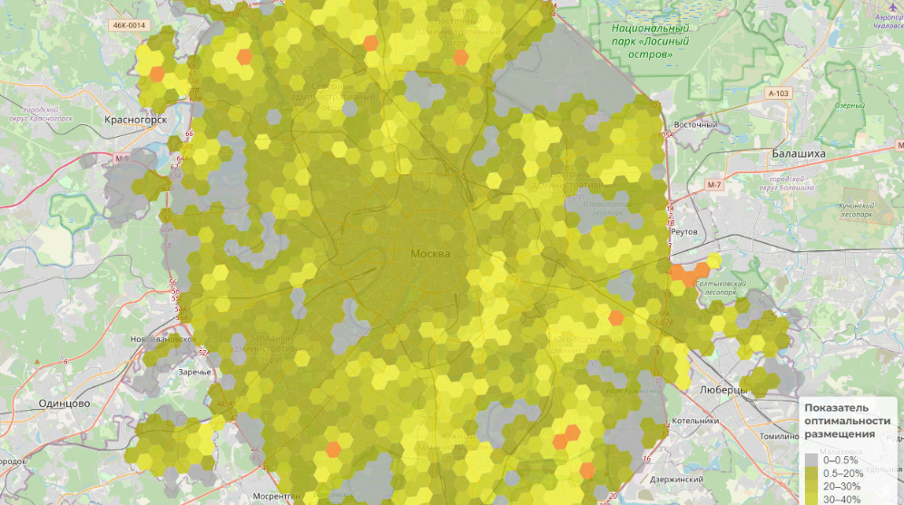
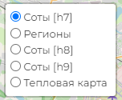
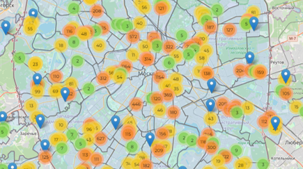
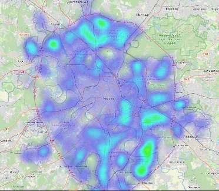
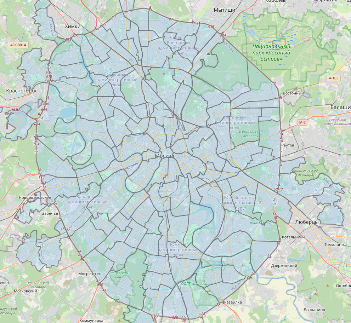
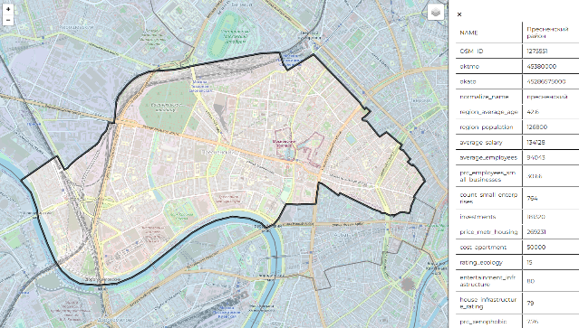

# Хакатон "Лидеры цифровой трансформации 2022" 
Хакатон при поддержки Правительства Москвы:
- https://www.mos.ru/news/item/116759073/
- https://leaders2022.innoagency.ru/
## Рекомендательный сервис для определения оптимальных мест размещения постаматов в рамках проекта «Московский постамат»
### Общее решение
- Сбор и обработка первичных данных. Сбор данных о местах размещения
- Разделение территории Москвы на Гексагоны
- Расчет характеристик для каждого «Объекта размещения» и «Гексагона».
- Формирование агрегированных показателей влияния на размещение постаматов (плотность населения, уровень цифровизации и пр.).
- Расчет с помощью ансамбля моделей машинного обучения рекомендации по размещению Московских постаматов.
- Реализация API по предоставлению сведений на Веб-сервис и во внешние источники.

#### Документация:
- [Презентация проекта](https://docs.google.com/presentation/d/12ZHWuMAE2iPXcYVOMOGHlD4roDUlGb8N/edit?usp=sharing&ouid=113491937784577068477&rtpof=true&sd=true)
- [Документация проекта](https://docs.google.com/document/d/1wPX5Wk80xtDoV3U6kHj0mLAGXLsyUYc-)

#### Собраны и подгтовлены более 50 признаков, включая:
- Пункты выдачи заказов (ПВЗ) и постаматы конкурентов
- Плотность населения
- Количество семей
- Кол-во жилых домов
- Автобусные/трамвайные остановки
- Автомобильные парковки
- Средний возраст в районе
- Отношение района (спальный/рабочий)
- Медианная цена за кв.метр в районе
- Средний доход в районе и пр. 
- Агрегированные признаки:
	- Уровень цифровизации (кол-во пунктов доставки еды, ПВЗ/постаматов, средний возраст, процент с высшим образованием и т.д.)
	- Уровень транспортной доступности (Кол-во и близость остановок общественного транспорта (метро и НГПТ), кол-во автопарковок)
	- Уровень покрытия района ПВЗ и постаматами (общее кол-во ПВЗ и постаматов)

#### Архитектура решения

#### Пользовательский интерфейс
##### Главное окно

- Рабочее пространство пользователя включает три области:
- Область карты
- Панель фильтрации/выбора параметров
- Панель просмотра дополнительных сведений

##### Поддериживаемые слои:
- Соты H7 - Гексагоны  размера 2,7км (радиус 1,35км)
- Соты H8 - Гексагоны размера 1км (радиус 500 метров)
- Соты H9 - Гексагоны размера 400 метров (радиус 200 метров)
- Районы - Муниципальные городские районы
- Тепловая карта

##### Группировка объектов
При выборе отображения объектов на карту, отображаются все выбранные в качестве рекомендуемых мест размещения объекты.
Для удобства они группируются в кластеры.

##### Тепловая карта с отображением рейтинга привлекательности территорий

##### Фильтрация и зум карты на основе выбранного района с отображением деталей выбранного района

#### Installation
- Install node modules npm install
- Set up routes in .env.sample
- Rename the .env.sample file to .env.local
- Run the project with npm run dev

#### Used library
##### Front
- Vue
- Vite
- Leaflet
- Axios
- Cors
- dotenv
- h3-js
- rbush
##### Backend
- Node.js
- Express
- modgodb
- body-parser
##### DS + DE 
- Python
- Pandas
- GeoPandas
- TensorFlow
- Scikitlearn
- Numpy
- re